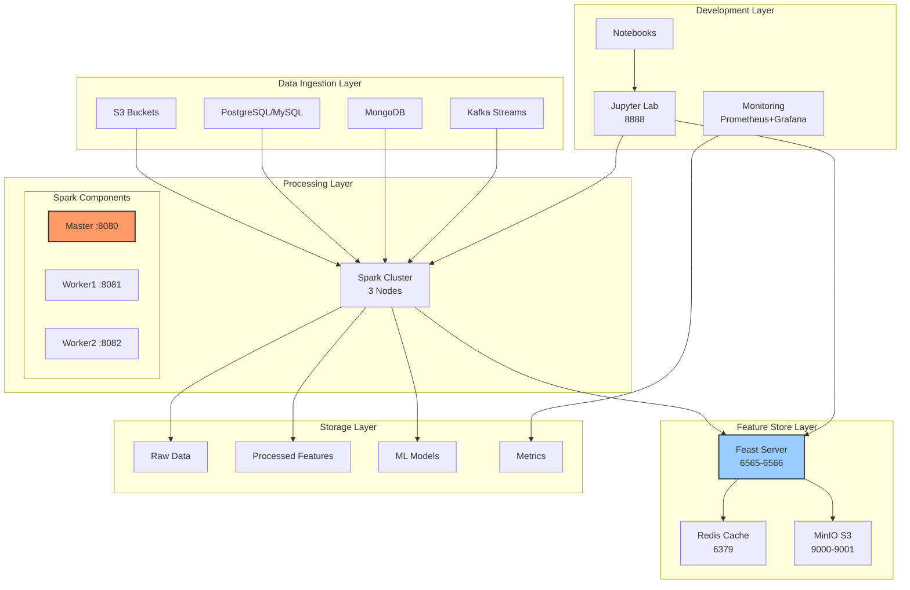
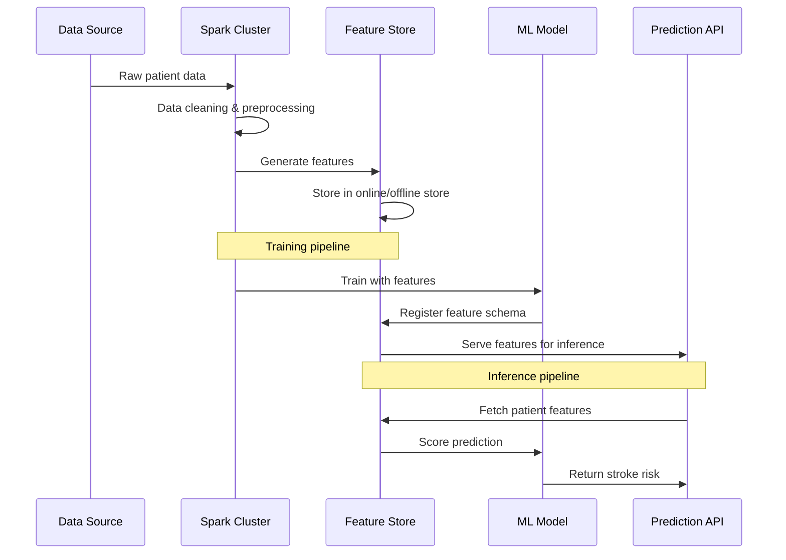
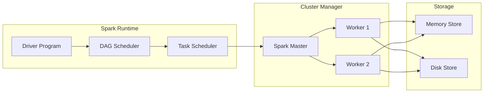
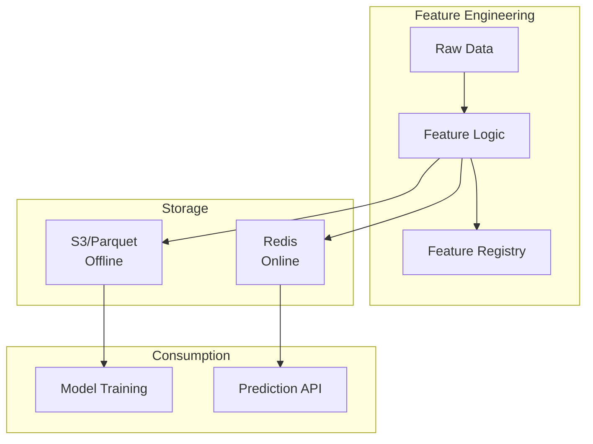

# StrokePredict Spark-Feast Project

This is a comprehensive project that demonstrates how to build a production-ready machine learning platform for stroke prediction using Apache Spark for distributed processing and Feast for feature store management. The project serves as a practical guide for understanding modern MLOps architecture patterns.

## What the project covers

Hands-on experience with:
* Distributed data processing with Apache Spark
* Feature store management with Feast
* Containerized MLOps architecture
* Data pipeline design for medical AI
* Monitoring and observability practices
* Extensible ML platform patterns

## Architecture Deep Dive
#### System Architecture


#### Data Flow Architecture


## Project Structure Explained
```bash
stroke-predict-spark-feast/
├── docker-compose.yml          # Orchestrates all services
├── Makefile                    # Common operations automation
├── requirements.txt            # Python dependencies
│
├── spark/                      # Spark configuration
│   └── conf/
│       ├── spark-defaults.conf # Spark runtime settings
│       ├── spark-env.sh        # Environment variables
│       └── log4j.properties    # Logging configuration
│
├── feast/                      # Feature store setup
│   ├── Dockerfile              # Custom Feast image
│   ├── entrypoint.sh           # Feast startup script
│   ├── feature_store.yaml      # Feature definitions
│   └── features.py             # Feature engineering code
│
├── jars/                       # External libraries
│   ├── mongo-spark/            # MongoDB connector for Spark
│   └── jmx-exporter/           # Monitoring agent
│
├── apps/                       # Spark applications
│   ├── data_processing.py      # ETL pipelines
│   ├── feature_engineering.py  # Feature creation logic
│   ├── model_training.py       # ML model training
│   └── stroke_predictor.py     # Prediction service
│
├── notebooks/                  # Interactive development
│   ├── 01_data_exploration.ipynb
│   ├── 02_feature_engineering.ipynb
│   └── 03_model_training.ipynb
│
├── monitoring/                 # Observability stack
│   ├── prometheus.yml          # Metrics collection
│   └── grafana/                # Dashboards
│
├── tests/                      # Test suites
│   ├── test_spark_connection.py
│   ├── test_feast_setup.py
│   └── test_mongo_connection.py
│
├── scripts/                    # Utility scripts
│   ├── setup-jars.sh           # Download dependencies
│   ├── generate_sample_data.py # Create test datasets
│   └── benchmark.py            # Performance testing
│
└── data/                       # Data volumes
    ├── raw/                    # Original datasets
    ├── processed/              # Cleaned features
    └── models/                 # Trained models
```

## Getting Started
##### Prerequisites
* Docker Engine 20.10+
* Docker Compose v2.0+
* 8GB+ RAM available for containers
* 10GB+ free disk space

##### Quick Start
```bash
# Clone the repository
git clone https://github.com/ThatoK3/stroke-predict-spark-feast.git
cd stroke-predict-spark-feast

# Setup external JARs (MongoDB Spark connector, JMX exporter)
make setup

# Build the custom Feast Docker image
make build-feast

# Start the entire cluster
make start

# Verify all services are healthy
make status
```

##### Access Points
```markdown
| Service              | URL                     | Purpose                 |
| -------------------- | ----------------------- | ----------------------- |
| Spark Master         | <http://localhost:8080> | Cluster management      |
| Spark Worker 1       | <http://localhost:8081> | Task execution          |
| Spark Worker 2       | <http://localhost:8082> | Task execution          |
| Jupyter Lab          | <http://localhost:8888> | Development environment |
| Feast Feature Server | <http://localhost:6565> | Feature serving         |
| Feast Registry       | <http://localhost:6566> | Feature definitions     |
| MinIO Console        | <http://localhost:9001> | Object storage UI       |
| Redis                | localhost:6379          | Feature cache           |

```

## Detailed Component Guide
#### Apache Spark Cluster
Spark provides distributed processing for large medical datasets. Our cluster consists of:
* **Master node**: Coordinates job execution and maintains cluster state
* **Worker nodes**: Execute distributed tasks in parallel
* **Jupyter integration**: Interactive development environment



#### Feast Feature Store
Feast provides consistent feature serving for training and inference:
* **Offline store**: Historical data for model training
* **Online store**: Low-latency serving for predictions
* **Registry**: Feature definitions and metadata




## Extension Examples
#### 1. Add Streaming Data Source
```python
# apps/streaming_processor.py
from pyspark.sql import SparkSession
from pyspark.sql.functions import window, avg

spark = SparkSession.builder.appName("StreamingProcessor").getOrCreate()

# Read from Kafka
kafka_df = spark \
    .readStream \
    .format("kafka") \
    .option("kafka.bootstrap.servers", "kafka:9092") \
    .option("subscribe", "patient-vitals") \
    .load()

# Process streaming vitals
vitals_features = kafka_df \
    .selectExpr("CAST(value AS STRING)", "timestamp") \
    .select(
        split(col("value"), ",").getItem(0).alias("patient_id"),
        split(col("value"), ",").getItem(1).cast("double").alias("heart_rate"),
        col("timestamp")
    ) \
    .groupBy(
        window(col("timestamp"), "5 minutes"),
        col("patient_id")
    ) \
    .agg(
        avg("heart_rate").alias("avg_heart_rate_5min")
    )

# Write to Feast online store
query = vitals_features \
    .writeStream \
    .foreachBatch(write_to_feast_online) \
    .outputMode("update") \
    .start()
```

#### 2. Multi-Model Registry
```python
# apps/model_registry.py
import mlflow
from feast import FeatureStore

class StrokeModelRegistry:
    def __init__(self, tracking_uri: str, feast_repo: str):
        self.mlflow = mlflow.tracking.MlflowClient(tracking_uri)
        self.feast = FeatureStore(repo_path=feast_repo)
    
    def register_model(self, model_name: str, model_uri: str, 
                      feature_service: str, metrics: dict):
        """Register model with feature service linkage"""
        
        # Log model in MLflow
        mlflow.register_model(model_uri=model_uri, name=model_name)
        
        # Update Feast feature service metadata
        feature_service = self.feast.get_feature_service(feature_service)
        feature_service.meta.update({
            "model_name": model_name,
            "model_uri": model_uri,
            "metrics": metrics
        })
        
        return feature_service
    
    def get_model_with_features(self, model_name: str, version: int):
        """Retrieve model and associated feature service"""
        model = self.mlflow.get_model_version(model_name, version)
        feature_service = self.feast.get_feature_service(
            model.meta.get("feature_service")
        )
        return model, feature_service
```

#### 3. Advanced Monitoring Dashboard
```python
# monitoring/dashboard.py
import plotly.graph_objects as go
from plotly.subplots import make_subplots
import pandas as pd

class StrokeMonitoringDashboard:
    def __init__(self, prometheus_url: str):
        self.prometheus = PrometheusClient(prometheus_url)
    
    def create_feature_drift_dashboard(self, feature_names: list):
        """Monitor feature distribution drift over time"""
        
        fig = make_subplots(
            rows=len(feature_names), 
            cols=1,
            subplot_titles=feature_names
        )
        
        for i, feature in enumerate(feature_names):
            # Query Prometheus for feature statistics
            mean_query = f'feast_feature_mean{{feature="{feature}"}}'
            std_query = f'feast_feature_std{{feature="{feature}"}}'
            
            mean_data = self.prometheus.query(mean_query)
            std_data = self.prometheus.query(std_query)
            
            # Add traces
            fig.add_trace(
                go.Scatter(x=mean_data['time'], y=mean_data['value'],
                          mode='lines', name=f'{feature} mean'),
                row=i+1, col=1
            )
            
            fig.add_trace(
                go.Scatter(x=std_data['time'], y=std_data['value'],
                          mode='lines', name=f'{feature} std'),
                row=i+1, col=1
            )
        
        fig.update_layout(height=300*len(feature_names), title_text="Feature Drift Monitor")
        return fig
```


## Deployment Patterns
#### Local Development
```bash
# Start full cluster locally
make start

# Develop in Jupyter
open http://localhost:8888
```

#### CI/CD Integration
```yaml
# .github/workflows/ml-pipeline.yml
name: ML Pipeline
on: [push, pull_request]

jobs:
  test:
    runs-on: ubuntu-latest
    steps:
      - uses: actions/checkout@v2
      - name: Start test cluster
        run: make start
      - name: Run tests
        run: make test
      - name: Stop cluster
        run: make stop
```

#### Cloud Deployment
```bash 
# Deploy to AWS EKS
kubectl apply -f k8s/spark-cluster.yaml
kubectl apply -f k8s/feast-deployment.yaml

# Or use Terraform
cd terraform/
terraform init
terraform apply
```

## Monitoring and Observability
#### Metrics Collection
```yaml
# monitoring/prometheus.yml
global:
  scrape_interval: 15s

scrape_configs:
  - job_name: 'spark'
    static_configs:
      - targets: ['spark-master:8080', 'spark-worker-1:8081', 'spark-worker-2:8082']
  
  - job_name: 'feast'
    static_configs:
      - targets: ['feast-server:6565']
  
  - job_name: 'jmx'
    static_configs:
      - targets: ['spark-master:7071', 'spark-worker-1:7072']
```

#### Key Metrics to Track
```markdown
| Metric               | Purpose               | Alert Threshold |
| -------------------- | --------------------- | --------------- |
| Feature freshness    | Data pipeline health  | > 1 hour        |
| Model accuracy       | Prediction quality    | < 0.85 AUC      |
| Pipeline latency     | End-to-end processing | > 30 minutes    |
| Resource utilization | Cluster efficiency    | > 80% CPU       |
| Error rate           | System reliability    | > 5% failure    |

```

## Common Issues and Solutions
#### Issue 1: Spark Workers Not Connecting
**Symptoms**: Workers show as "DEAD" in Spark UI
**Solution**:
```bash
# Check network connectivity
docker exec spark-worker-1 ping spark-master

# Verify ports are open
docker exec spark-master netstat -tulpn | grep 7077

# Restart with logs
docker compose restart spark-worker-1
docker logs spark-worker-1
```
 
#### Issue 2: Feast Feature Materialization Fails
**Symptoms**: Features not appearing in online store
**Solution**:
```python
# Check Feast logs
!docker logs feast-server

# Verify Redis connection
!docker exec stroke-redis redis-cli ping

# Re-materialize features
from feast import FeatureStore
store = FeatureStore(repo_path="feast")
store.materialize_incremental(end_date=datetime.now())
```

#### Issue 3: Out of Memory Errors
**Symptoms**: Jobs fail with OOM exceptions
**Solution**:
```bash 
# Increase memory in spark-defaults.conf
spark.executor.memory=4g
spark.driver.memory=2g

# Or set dynamically
spark.conf.set("spark.executor.memory", "4g")
```

## Performance Optimization
#### Spark Tuning
```properties
# spark-defaults.conf
spark.sql.adaptive.enabled=true
spark.sql.adaptive.coalescePartitions.enabled=true
spark.dynamicAllocation.enabled=true
spark.dynamicAllocation.minExecutors=2
spark.dynamicAllocation.maxExecutors=10
```

#### Feast Optimization
```yaml
# feature_store.yaml
online_store:
  type: redis
  connection_string: redis://stroke-redis:6379
  max_retries: 3
  ttl_seconds: 3600  # 1 hour cache
```


